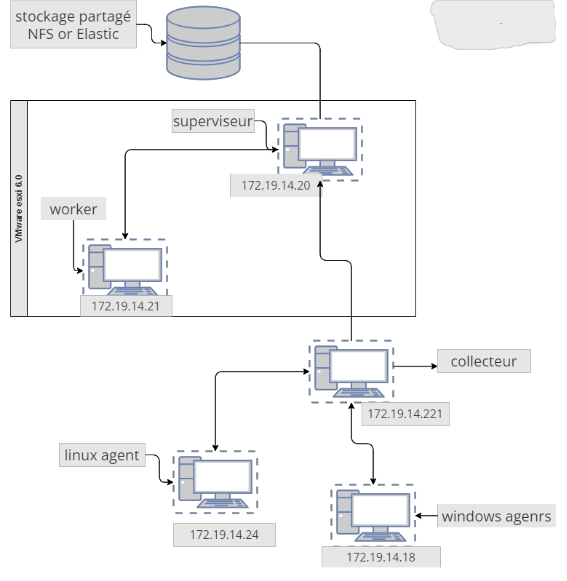
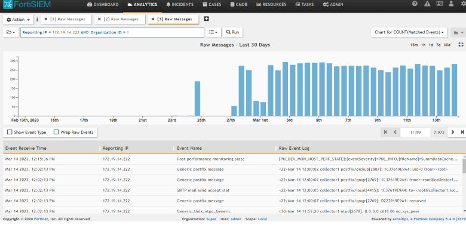
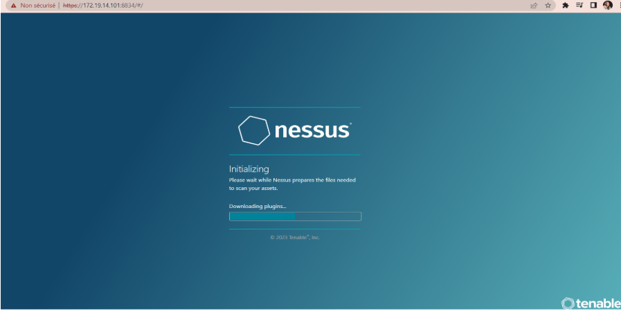
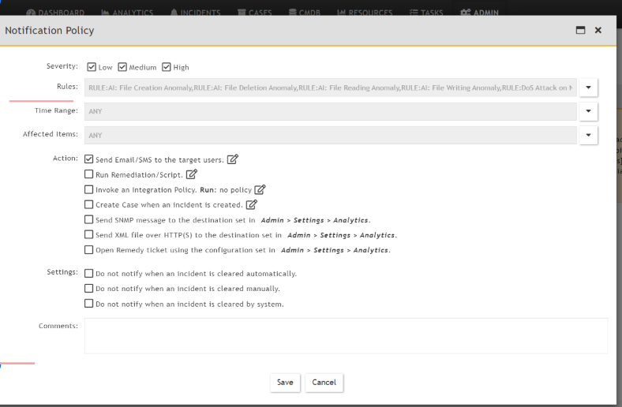

# 🛡️ Study and Implementation of the Fortinet SIEM Solution  

 

  
📘 **Author:** *Hadir Ben Arbia*  
📅 **Date:** May 2023  

---

## 📘 Overview & Objectives

This project focuses on the **study and implementation of Fortinet’s SIEM solution (FortiSIEM)** to enhance **network visibility, threat detection, and incident response** within an enterprise environment.  

Developed during an engineering internship at **PROLOGIC Tunisie**, the project involved the deployment and configuration of a **FortiSIEM-based monitoring system** that:  
- Collects and correlates security events from various network sources.  
- Integrates the **Nessus Vulnerability Scanner** for proactive vulnerability assessment.  
- Utilizes an **SMTP Mail Server** to deliver automated alerts and security reports in real time.  

This implementation demonstrates how FortiSIEM can provide a centralized, intelligent, and responsive approach to managing information security events across complex IT infrastructures.

---

## ⚙️ System Architecture

The implemented architecture consists of multiple virtualized components hosted on **VMware ESXi**:

| Component | Role |
|------------|------|
| 🧠 **Supervisor** | Centralized management and orchestration of the FortiSIEM environment. |
| 🧩 **Collector** | Aggregates logs and events from network and system sources. |
| ⚙️ **Worker** | Analyzes data, applies correlation rules, and generates alerts. |
| 🐧 **Windows/Linux Agents** | Send event logs to FortiSIEM |
| 🧰 **Nessus Scanner** | Performs vulnerability scans and integrates with FortiSIEM. |
| ✉️ **Mail Server (SMTP)** | Sends alert and incident notifications. |

> 📊 Each element contributes to real-time monitoring, detection, and reporting of security events.

---

### 🖼️ Architecture Diagram (Placeholder)

## 🌐 Network Topology

  

---

## 🧰 Technologies Used

| Category | Technology |
|-----------|-------------|
| **SIEM Solution** | FortiSIEM 5.4 |
| **Virtualization** | VMware ESXi 6.7 |
| **Operating System** | Red Hat Enterprise Linux |
| **Vulnerability Scanning** | Nessus Professional |
| **Mailing & Alerts** | SMTP Server |
| **Data Collection Protocols** | Syslog, SNMP, WMI |

---

## ⚙️ Deployment Summary

### 1️⃣ Environment Setup
- Configure VMware ESXi hosts and allocate compute/storage resources.  
- Prepare Red Hat VMs for FortiSIEM components.

### 2️⃣ FortiSIEM Installation
- Deploy **Supervisor**, **Collector**, and **Worker** virtual machines.  
- Configure IPs, routing, and access policies.

### 3️⃣ Agent Configuration
- Install and link **Windows** and **Linux Agents** for event collection.

### 4️⃣ Nessus Integration
- Connect Nessus via API and enable vulnerability data import into FortiSIEM.

### 5️⃣ Mail Server Setup
- Configure SMTP settings to enable email alert notifications.

### 6️⃣ Validation
- Generate test incidents and verify:
  - Data correlation accuracy.
  - Alert triggering and notification flow.
  - Nessus scan results appearing in FortiSIEM dashboard.

---

## 🧩 Key Features

✅ **Real-time Monitoring** — Continuous collection of security and performance events.  
✅ **Centralized Log Management** — Aggregates logs from multiple sources.  
✅ **Threat Detection & Correlation** — Identifies anomalies and attack patterns.  
✅ **Automated Vulnerability Scanning** — Integrates with Nessus for proactive defense.  
✅ **Email Alerting System** — Sends alerts and summaries through SMTP.  
✅ **Compliance Reporting** — Generates reports aligned with regulatory requirements.  

---

## 📸 Screenshots

| Description | Screenshot |
|--------------|-------------|
| FortiSIEM Dashboard |  |
| Nessus Scan Results |  |
| Alert Notification Configuration |  |

---

## 📊 Results & Benefits

- Improved **visibility** into network events and user activity.  
- Faster **incident response** through automated alerts.  
- Enhanced **vulnerability management** and compliance readiness.  
- Scalable and modular architecture suitable for enterprise environments.

---

## 🚀 Future Enhancements

- Integration with **FortiAnalyzer** for deeper analytics.  
- Deployment of **SOAR** workflows for automated response.  
- Expansion to **multi-cloud monitoring** (AWS, Azure, GCP).  

---

## 👩‍💻 Author

**👤 Hadir Ben Arbia**  
🎓 Engineering Student — Computer Systems (Network & Security)   
🏢 Internship at **PROLOGIC Tunisie**

📧 [belarbiahedir@gmail.com](mailto:belarbiahedir@gmail.com)  
🔗 (https://www.linkedin.com](https://www.linkedin.com/in/hadir-ben-arbia/)

---

## 📚 References

- [Fortinet FortiSIEM Documentation](https://docs.fortinet.com/fortisiem)  
- [Nessus Vulnerability Scanner Guide](https://www.tenable.com/products/nessus)  
- [FortiSIEM Notification Settings](https://help.fortinet.com/fsiem/5-1-0/Online-Help/HTML5_Help/Notification_Settings.htm)  
- [PROLOGIC Tunisie](https://www.prologic.com.tn/)

---

⭐ *If you found this project helpful, consider giving it a star on GitHub!*
